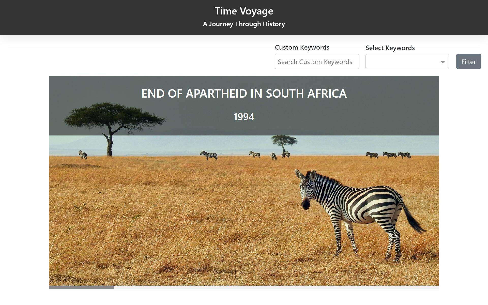
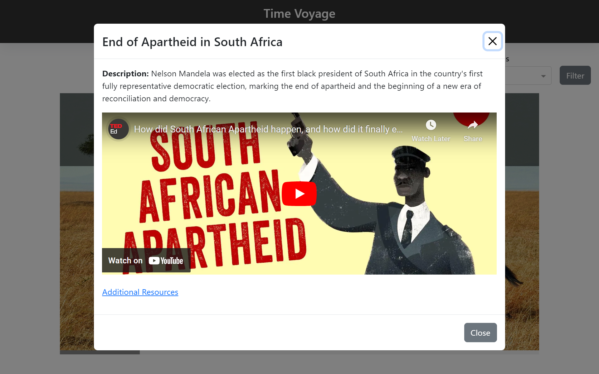

## Overview
### TimeVoyage: A Journey Through History
#### Description: TimeVoyage is a user-friendly  Angular web application that presents a chronological timeline of historical events in a simple and intuitive interface.
##### Deployed URL: https://time-voyage.vercel.app/
## Features
- Horizontal Timeline: Explore different time periods in a chronological order by scrolling horizontally through the timeline.
- Interactive Popup: Dive deeper into the timeline's content with interactive popups providing additional resources such as images, videos, or links.
- Filter Options: Quickly access specific sets of timelines by utilizing convenient filter options.

## Screenshots

## Development server

Run `ng serve` for a dev server. Navigate to `http://localhost:4200/`. The application will automatically reload if you change any of the source files.

This project was generated with [Angular CLI](https://github.com/angular/angular-cli) version 17.0.8.
